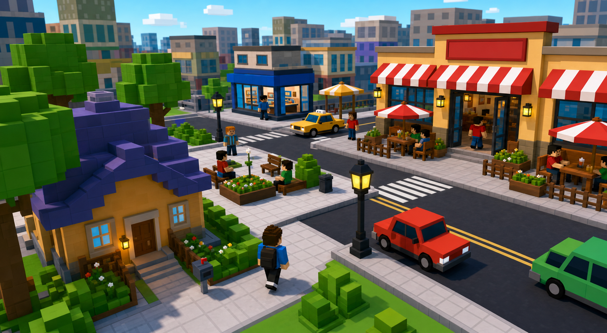
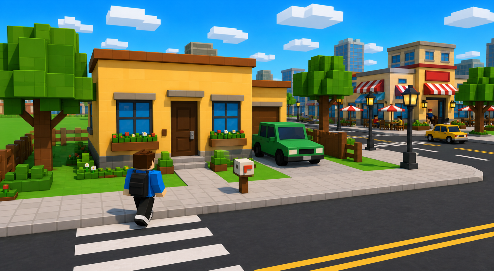
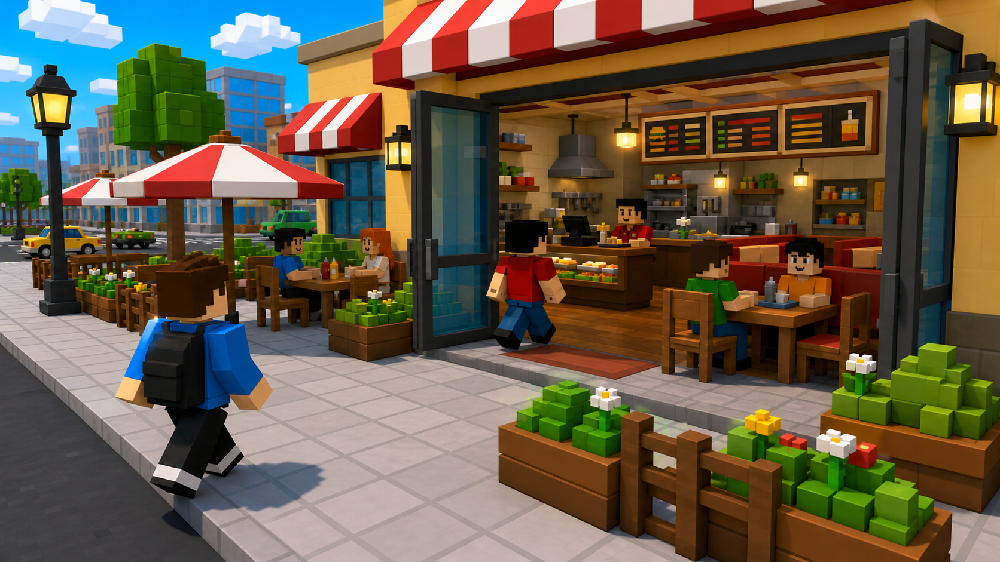
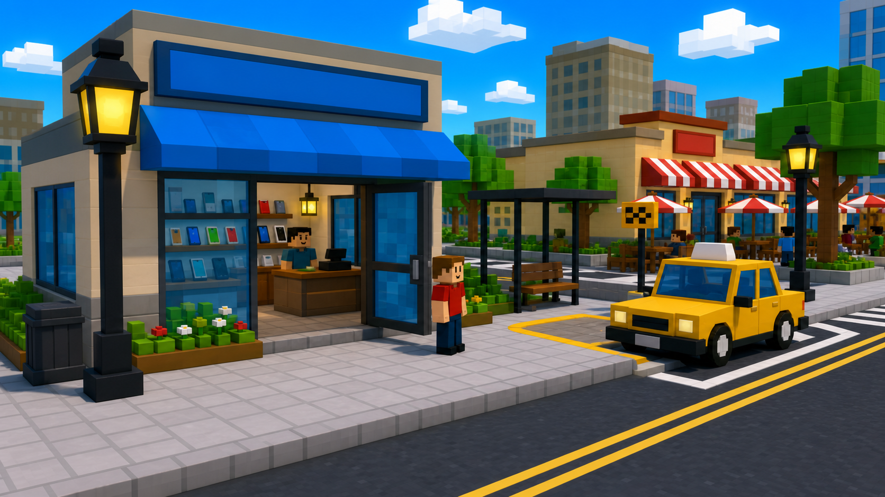
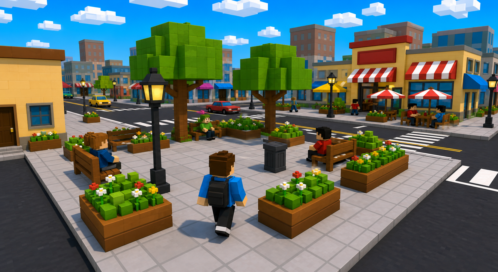

# V1 Small Map Design

## Goal

Build a compact V1 playable map around a small neighborhood block. The map starts near the player's house and quickly leads into a restaurant street with a few nearby test locations.

This is not the final city. It is a small vertical slice for proving scale, object detail, enterable buildings, NPC movement, interaction points, and mini-map readability.

Do not prioritize lighting, post-processing, camera recreation, or graphics polish in this pass. The priority is objects, layout, interiors, player-scale detail, and movement loops.

## Design Images

Use these saved repo assets as the visual references for the V1 layout and core locations. These are concept-art style references, not schematic diagrams.











## Map Shape

The V1 map should be one short playable block, arranged as a loop:

```text
Player House Spawn
  -> sidewalk path
  -> pocket park / plaza
  -> crosswalk
  -> open restaurant + patio
  -> phone shop + taxi curb
  -> back toward house
```

The player should always understand where to go next. The route should be short enough that every core location is reachable in under 20 seconds.

The map should avoid huge empty fields, giant tiled plazas, and long dead roads. Every open area should have a clear reason: walking path, patio zone, vehicle curb, park corner, or mini-map landmark.

## Core Location 1: Player House Spawn

The player starts outside their house, on a front path leading to the sidewalk. This gives V1 a home base instead of dropping the player directly into the restaurant street.

Objects to include:

- House exterior with front door and readable windows
- Small porch or front step
- Front path from door to sidewalk
- Mailbox
- Driveway or parked car
- Small planter boxes near the door or windows
- Spawn marker or spawn-safe area
- Optional simple interior hook for later, but not required for V1

Gameplay purpose:

- Establish the player's starting identity
- Give a clear first direction
- Provide a short walk into the main block
- Create a natural place for tutorial prompts or phone prompts

## Core Location 2: Open Restaurant

The restaurant is the hero location. Improve the existing restaurant idea into an actual enterable place, not a closed facade.

Exterior objects:

- Large enterable door
- Big blue front windows
- Visible interior through windows and doorway
- Thick red-and-white awnings
- Sign panel above the entrance
- Door frame and window frames
- Raised trim and base trim
- Wall-mounted lamps as real objects
- Patio attached directly to the entrance
- Chunky planter boxes around the entrance and windows

Interior objects:

- Ordering counter
- Cash register
- Menu board
- Prep or kitchen area behind the counter
- Staff zone
- Indoor tables and chairs
- Booth or bench seating
- Shelves, cups, plates, trays, food blocks, and condiment bottles
- Trash bin
- Decorative plants
- Clear walking paths for player and NPCs

Outdoor patio objects:

- Tables scaled for NPCs
- Chairs with backs and legs
- Large umbrellas with poles, top caps, and thick red-white canopy sections
- Low patio fence pieces
- Chunky planter borders
- Tabletop props: cups, plates, condiment bottles, menu blocks, food items
- Seating markers for NPCs

NPC behavior to test:

- Enter restaurant
- Queue at counter
- Order food
- Sit inside
- Sit outside
- Stand up and leave
- Walk back to sidewalk

## Core Location 3: Phone Shop + Taxi Curb

This is a smaller utility location near the restaurant. It should test shop interaction and future travel/pickup behavior without becoming the main attraction.

Phone shop objects:

- Small enterable or partially enterable shop
- Front door
- Front window
- Clear sign
- Counter
- Display shelves
- Phone or convenience item props
- NPC worker
- One or two NPC customers

Taxi curb objects:

- Parked taxi
- Taxi pickup sign
- Waiting spot
- NPC waiting near curb
- Interaction marker
- Curbside placement connected to the road

Gameplay purpose:

- Test a non-restaurant interior or service counter
- Give the phone UI a physical place in the world
- Create a future fast-travel pickup point
- Add a short NPC loop from shop to taxi curb

## Core Location 4: Pocket Park / Sidewalk Plaza

This is a small landmark between the house and the restaurant. It should be a compact route break, not a huge park.

Objects to include:

- One to three blocky trees
- Benches
- Planter boxes
- Trash bin
- Short path or plaza paving
- Lamp post
- One or two idle NPCs

Gameplay purpose:

- Break up the walk from home to restaurant
- Provide a mini-map landmark
- Test idle NPC placement
- Add greenery without creating an empty field

## NPC Loops

V1 should show simple movement. Static NPCs alone are not enough.

Required loops:

- Sidewalk loop: NPC walks along the main sidewalk and turns around.
- Restaurant entry loop: NPC enters the restaurant, queues, sits, then leaves.
- Patio loop: NPC walks to an outdoor table, sits/idles, then leaves.
- Crosswalk loop: NPC crosses at the crosswalk only.
- Phone shop loop: NPC enters or exits the shop.
- Taxi loop: NPC waits near taxi pickup.
- Park idle loop: NPC stands or sits near a bench.

These can be simple waypoint paths. They do not need final AI logic yet.

## Mini-Map Requirements

The mini-map should show this small block clearly. It should not pretend to be a full city.

Required icons or labels:

- Player position
- Player house
- Restaurant
- Phone shop
- Taxi pickup
- Pocket park
- Road and crosswalk

The mini-map should reinforce the loop: house to park to restaurant to shop/taxi and back.

## Object Scale Rules

Objects should be built at player scale, not map-symbol scale.

Use fewer, chunkier, more readable objects instead of many tiny placeholders.

Scale requirements:

- Doors should feel enterable.
- Counters should be NPC/player height.
- Tables should fit NPCs.
- Chairs should have visible backs and legs.
- Umbrellas should actually cover tables.
- Planter boxes should feel substantial.
- Flowers should be readable voxel objects, not tiny colored dots.
- Windows should have frames and depth.
- Signs should be readable as signs even if text is placeholder.

## V1 Acceptance Checklist

The V1 map pass is successful when:

- Player spawns near the house.
- The route to the restaurant is obvious.
- The restaurant is enterable.
- The restaurant interior contains actual usable objects.
- Outdoor patio furniture is large and readable.
- Umbrellas feel like real objects, not flat slabs.
- Planters are chunky and define space.
- NPCs visibly move in and out of at least one building.
- NPCs can sit or idle at restaurant tables.
- Phone shop and taxi curb are present as secondary locations.
- Pocket park is present as a compact landmark.
- Mini-map shows all core locations.

## Implementation Priority

1. Block the map loop and place the four core locations.
2. Make the restaurant enterable and build the interior.
3. Upgrade patio scale: tables, chairs, umbrellas, planters.
4. Add phone shop, taxi curb, and pocket park objects.
5. Add NPC waypoint loops.
6. Update mini-map icons.
7. Only after these work, revisit lighting or graphics polish.
